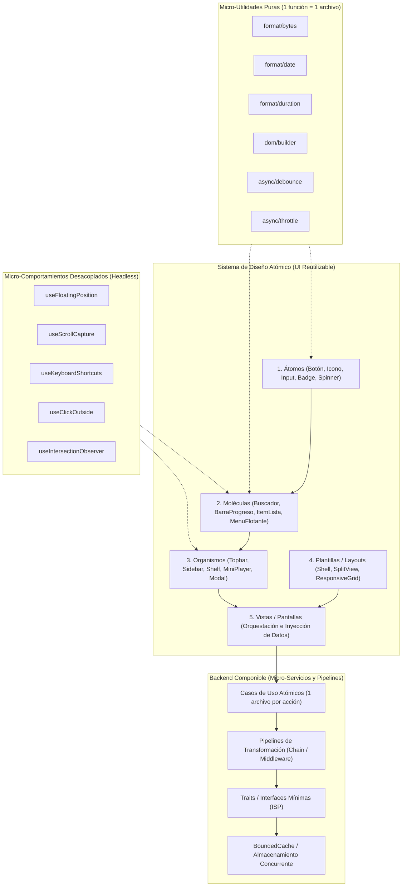
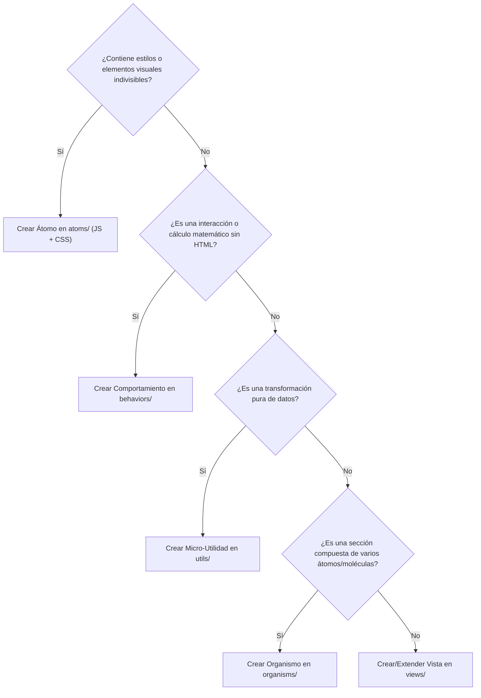

# Manifiesto de Arquitectura: Micro-Modularidad Extrema y Componentes Reutilizables

Este documento establece la **filosofía, estándares y patrones de diseño para alcanzar el nivel máximo de micro-modularidad y reutilización** en cualquier proyecto de software (aplicaciones de escritorio, móviles o web).

Su objetivo es convertir cada elemento del sistema —desde la función de utilidad más pequeña hasta el componente visual o servicio de dominio más complejo— en una **pieza atómica, independiente, componible y 100% reutilizable** en cualquier otro proyecto.

---

## 1. Filosofía Central: Micro-Modularidad y Componibilidad Total

La premisa innegociable de esta arquitectura es que **nada debe ser monolítico ni estar acoplado a un contexto específico**:

1. **Granularidad Atómica (Micro-Módulos):** Si una función, cálculo, comportamiento o elemento visual puede tener sentido por sí mismo, **debe vivir en su propio archivo independiente**.
2. **Componentes como Funciones Puras de UI:** Un componente de interfaz no conoce la fuente de los datos (ni APIs, ni bases de datos, ni IPC). Recibe datos/configuración vía parámetros y emite eventos/callbacks hacia el exterior.
3. **Composición sobre Monolitos:** Las piezas complejas no se programan desde cero; se construyen **ensamblando micro-piezas existentes** (Átomos $\rightarrow$ Moléculas $\rightarrow$ Organismos $\rightarrow$ Vistas).
4. **Desacoplamiento de Comportamiento (Headless Behaviors / Hooks):** La lógica interactiva (matemáticas de posicionamiento flotante, atajos de teclado, detección de clics externos, observadores de visibilidad, arrastre) se programa en módulos independientes sin atarse al DOM visual.
5. **Inversión de Control y Dependencias Unidireccionales:**
   $$\text{Vistas} \longrightarrow \text{Organismos} \longrightarrow \text{Moléculas} \longrightarrow \text{Átomos} \longrightarrow \text{Primitivas / Tokens}$$
   $$\text{Adaptadores / Handlers} \longrightarrow \text{Casos de Uso (1 por acción)} \longrightarrow \text{Pipelines / Traits} \longrightarrow \text{Infraestructura}$$



---

## 2. Nivel de Modularidad: Comparativa Estándar vs. Micro-Modularidad Extrema

| Dimensión | Enfoque Modular Convencional | Enfoque de Micro-Modularidad Extrema (Este Estándar) |
| :--- | :--- | :--- |
| **Utilidades** | Archivo `utils.js` o `helpers.rs` con 20 funciones. | **1 archivo por función** (`format/bytes.js`, `format/duration.js`). |
| **Componentes UI** | Tarjeta con imagen, botones, menú y lógica de red. | **Separación en 4 capas:** Átomo (Badge/Icon), Molécula (CardActions), Organismo (Card), Comportamiento (`useFloatingPosition`). Cero lógica de red en la UI. |
| **Lógica Interactiva** | Eventos mezclados dentro del componente visual. | **Comportamientos "Headless"** reutilizables en cualquier elemento (`useClickOutside`, `useScrollCapture`). |
| **Servicios Backend** | `UserService.rs` con 15 métodos distintos. | **1 archivo por Caso de Uso / Comando** (`GetUserData.rs`, `UpdatePreferences.rs`), compartiendo pipelines de datos. |
| **Transformaciones** | Métodos gigantes con descompresión, descifrado y parseo en bloque. | **Pipelines componibles** por etapas (`Pipeline::new().pipe(Decompress).pipe(Decrypt).pipe(Parse)`). |
| **Estilos CSS** | Un CSS grande por módulo o estilos anidados en línea. | **CSS Atómico 1:1:** CSS por cada átomo, molécula, organismo y token de diseño. Cero estilos repetidos. |
| **Estado** | Un gran Store global monolítico reactivo. | **Micro-Stores / Señales Atómicas:** Instancias independientes de canales y estado por recurso. |

---

## 3. Desglose de Cosas que se Micro-Modularizan

---

### 3.1 Frontend: Sistema de Diseño Atómico en 5 Niveles (`ui/js/components/` y `ui/styles/`)

Para que la interfaz sea 100% componible, ningún componente grande se escribe de forma monolítica. Se divide estrictamente en:

```
ui/
├── js/
│   ├── components/
│   │   ├── atoms/              # Nivel 1: Indivisibles, agnósticos de negocio
│   │   │   ├── button.js       # Botón con variantes (primary, ghost, danger)
│   │   │   ├── icon.js         # Wrapper SVG con currentColor y tamaño
│   │   │   ├── badge.js        # Etiqueta de estado o contador
│   │   │   ├── spinner.js      # Indicador de carga animado
│   │   │   ├── input.js        # Campo de texto controlado
│   │   │   ├── slider.js       # Barra de deslizamiento / volumen / progreso
│   │   │   └── avatar.js       # Imagen cuadrada/redonda con respaldo de iniciales
│   │   │
│   │   ├── molecules/          # Nivel 2: Combinación de átomos con función acotada
│   │   │   ├── search-box.js   # Input + Icono buscar + Botón limpiar
│   │   │   ├── progress-bar.js # Slider/Barra + Badge de porcentaje + Texto
│   │   │   ├── card-menu.js    # Menú flotante auto-posicionable con items de acción
│   │   │   ├── icon-button.js  # Icono dentro de un contenedor táctil accesible
│   │   │   ├── chip-filter.js  # Píldora interactiva de selección con estado activo
│   │   │   └── toast-card.js   # Mensaje emergente con icono, texto y botón cerrar
│   │   │
│   │   ├── organisms/          # Nivel 3: Secciones UI completas y reutilizables
│   │   │   ├── topbar.js       # Barra superior (Hamburguesa + Título + Acciones)
│   │   │   ├── sidebar.js      # Barra lateral o inferior de navegación
│   │   │   ├── shelf.js        # Carrusel horizontal desplazable con cabecera
│   │   │   ├── cover-card.js   # Tarjeta de contenido (Avatar + Textos + Acciones + Menú)
│   │   │   ├── modal-dialog.js # Ventana modal con overlay, cabecera, cuerpo y pie
│   │   │   ├── media-player.js # Reproductor (Barra de progreso + Controles + Tiempo)
│   │   │   └── empty-state.js  # Pantalla de estado vacío con ilustración y acción
│   │   │
│   │   └── layouts/            # Nivel 4: Esqueletos de distribución espacial
│   │       ├── shell-layout.js # Layout general (Topbar + Sidebar + Contenedor)
│   │       ├── split-pane.js   # Vista dividida ajustable (Master-Detail)
│   │       └── grid-layout.js  # Rejilla auto-ajustable basada en CSS Grid
│   │
│   └── views/                  # Nivel 5: Pantallas (Orquestación)
│       ├── home.js             # Ensambla Shelf + CoverCards + Topbar
│       ├── catalog.js          # Ensambla SearchBox + ChipFilters + GridLayout
│       └── reader.js           # Ensambla SplitPane + DocumentContent + Player
```

#### Reglas de Oro de los Componentes UI:
- **Cero llamadas de red directas dentro de Átomos y Moléculas:** Los componentes reciben datos mediante propiedades/argumentos y notifican interacciones vía callbacks (`onClick`, `onSelect`, `onChange`).
- **Encapsulación total de ciclo de vida:** Cada componente expone una interfaz consistente:
  ```javascript
  export function createMyComponent(props) {
    // 1. Crear elementos usando el builder DOM atómico
    // 2. Asociar comportamientos headless
    // 3. Retornar el elemento raíz o un controlador { el, update(newProps), destroy() }
  }
  ```

---

### 3.2 Frontend: Micro-Comportamientos "Headless" (`ui/js/behaviors/`)

Son módulos de lógica interactiva pura que calculan coordenadas, detectan eventos o gestionan estados efímeros **sin pintar HTML directamente**:

```
ui/js/behaviors/
├── useFloatingPosition.js    # Cálculo matemático de menús emergentes (evita salirse de pantalla)
├── useScrollCapture.js       # Oyente de scroll optimizado con requestAnimationFrame
├── useClickOutside.js        # Detección de clics fuera de un elemento para autocierre
├── useKeyboardShortcuts.js   # Enrutador de atajos de teclado con registro/limpieza
├── useIntersection.js        # Carga perezosa (Lazy Loading) mediante IntersectionObserver
├── useDragAndDrop.js         # Control de arrastre táctil y de ratón
└── useLongPress.js           # Detección de pulsación prolongada en móvil
```

#### Ejemplo de Reutilización de un Comportamiento:
Cualquier menú flotante, tooltip o cuadro desplegable de la aplicación utiliza el mismo `useFloatingPosition.js` y `useClickOutside.js`, eliminando código duplicado de cálculo visual.

---

### 3.3 Frontend: Micro-Utilidades Puras (`ui/js/utils/`)

Prohibido el archivo genérico `utils.js`. Cada función utilitaria es pura (sin efectos secundarios) y vive en su propio archivo:

```
ui/js/utils/
├── dom/
│   ├── builder.js            # Función el(tag, props, children) para crear nodos
│   ├── sanitize.js           # Limpieza y saneamiento de cadenas HTML
│   └── animate.js            # Transiciones CSS por micro-promesas
├── format/
│   ├── bytes.js              # 1048576 -> "1.0 MB" / "1 MiB"
│   ├── duration.js           # 125 -> "02:05"
│   ├── relativeDate.js       # Timestamp -> "Hace 2 horas"
│   └── truncate.js           # Texto -> "Texto recortado..."
├── async/
│   ├── debounce.js           # Retrasar ejecución hasta cese de eventos
│   ├── throttle.js           # Limitar tasa de ejecución por segundo
│   └── queue.js              # Cola secuencial de tareas asíncronas
└── storage/
    ├── localStore.js         # Wrapper tipado con fallback de localStorage
    └── memoryCache.js        # Caché LRU en memoria con límite de entradas
```

---

### 3.4 Frontend: Micro-Estado Reactivo y Señales (`ui/js/core/state/`)

En lugar de un almacén global monolítico, el estado se divide en **micro-almacenes atómicos e independientes (Signals/Channels)**:

```
ui/js/core/state/
├── createSignal.js           # Primitiva de estado reactivo (get, set, subscribe)
├── createEventBus.js         # Emisor/receptor de eventos tipados desacoplado
├── networkStatus.js          # Señal reactiva: online / offline
├── activeTheme.js            # Señal reactiva: light / dark / high-contrast
├── playbackState.js          # Señal reactiva: estado de reproducción actual
└── activeModal.js            # Señal reactiva: modal actualmente abierto en pantalla
```

#### Ventaja de este modelo:
Si cambia el estado de reproducción (`playbackState`), **únicamente el mini-reproductor y los controles asociados se re-renderizan**, sin obligar a toda la aplicación a recalcular su vista.

---

### 3.5 Sistema de Estilos: CSS Micro-Modular y Tokens Atómicos (`ui/styles/`)

El sistema de estilos aplica la misma filosofía atómica que el código JavaScript:

```
ui/styles/
├── tokens/                   # 1. Variables de diseño elementales
│   ├── colors.css            # Paleta de color, temas, alphas
│   ├── spacing.css           # Escala de márgenes y paddings (--space-1, --space-2...)
│   ├── typography.css        # Fuentes, tamaños, pesos y alturas de línea
│   ├── elevations.css        # Sombras y capas z-index (--z-modal, --z-toast)
│   └── motion.css            # Curvas bézier y duraciones de animación
│
├── base/                     # 2. Resets y tipografía global
│   ├── reset.css             # Box-sizing, normalización
│   └── typography.css        # Reglas base de texto y encabezados
│
├── layouts/                  # 3. Estructuras de contenedor
│   ├── shell.css
│   ├── split-pane.css
│   └── grid.css
│
├── atoms/                    # 4. Estilos de Átomos (1:1 con JS)
│   ├── button.css
│   ├── badge.css
│   ├── spinner.css
│   ├── icon.css
│   └── input.css
│
├── molecules/                # 5. Estilos de Moléculas (1:1 con JS)
│   ├── search-box.css
│   ├── progress-bar.css
│   ├── card-menu.css
│   └── toast.css
│
├── organisms/                # 6. Estilos de Organismos (1:1 con JS)
│   ├── topbar.css
│   ├── sidebar.css
│   ├── shelf.css
│   └── media-player.css
│
├── views/                    # 7. Estilos específicos por pantalla
│   ├── home.css
│   └── reader.css
│
└── overrides/                # 8. Modificadores finales
    ├── dark.css              # Sobreescritura de tokens en modo oscuro
    └── mobile.css            # Adaptación responsive según geometría
```

---

### 3.6 Backend: Arquitectura Basada en Pipelines, Traits y Casos de Uso

En el backend, la modularidad extrema se alcanza mediante **Pipelines Componibles, Interfaces Mínimas (Traits) y Casos de Uso Aislados (1 acción = 1 archivo)**.

```
backend/src/
├── core/
│   ├── domain/               # Entidades y tipos de dominio puro
│   │   ├── item.rs
│   │   └── user_config.rs
│   │
│   ├── use_cases/            # Casos de uso (1 struct por acción del sistema)
│   │   ├── get_item_details.rs
│   │   ├── search_catalog.rs
│   │   ├── download_media_stream.rs
│   │   └── sync_user_data.rs
│   │
│   ├── pipelines/            # Flujos de transformación componibles
│   │   ├── pipeline.rs       # Estructura de encadenamiento (Chain/Runner)
│   │   ├── stages/           # Etapas de procesamiento independientes
│   │   │   ├── decompress.rs # Etapa: Descompresión de flujo
│   │   │   ├── decrypt.rs    # Etapa: Descifrado criptográfico
│   │   │   ├── filter.rs     # Etapa: Filtrado de registros
│   │   │   └── parse_sql.rs  # Etapa: Parseo de sentencias
│   │
│   ├── ports/                # Interfaces abstractas mínimas (Traits / ISP)
│   │   ├── storage_port.rs   # Trait: Almacenamiento clave-valor / SQL
│   │   ├── network_port.rs   # Trait: Descarga y peticiones HTTP
│   │   └── cache_port.rs     # Trait: Almacén temporal de alta velocidad
│   │
│   └── infra/                # Implementaciones concretas de los puertos
│       ├── sqlite_storage.rs
│       ├── http_client.rs
│       └── memory_lru_cache.rs
│
├── commands/                 # Adaptadores de comunicación (1 archivo por dominio)
│   ├── catalog_handlers.rs   # Recibe llamada externa -> invoca use_case -> devuelve DTO
│   └── media_handlers.rs
│
└── state/                    # Estado concurrente granular
    ├── app_state.rs          # Agrupador de referencias Arc<Mutex<T>> / Arc<RwLock<T>>
    └── bounded_pool.rs       # Gestor genérico de límites de memoria y recursos
```

#### Patrón Pipeline Componible:
Cualquier procesamiento pesado se construye componiendo etapas modulares:
```rust
// Ejemplo conceptual de composición de pipeline sin acoplamiento
let result = Pipeline::new(raw_stream)
    .pipe(DecompressStage::new(CompressionType::Gzip))
    .pipe(DecryptStage::new(encryption_key))
    .pipe(SqlParserStage::new())
    .execute()?;
```

---

## 4. Guía Práctica: ¿Cómo Atomizar un Concepto?

Cuando vayas a crear o refactorizar cualquier funcionalidad, aplica el **Test de Atomización en 4 Preguntas**:



---

## 5. Catálogo de Micro-Módulos Esenciales para Cualquier Proyecto

Para transferir esta arquitectura a cualquier nuevo proyecto, utiliza este catálogo de micro-módulos base recomendados:

### Primitivas de Frontend
- [`dom/builder.js`](#): Función constructora de nodos DOM con soporte de atributos, eventos y anidamiento.
- [`behaviors/useFloatingPosition.js`](#): Motor de anclaje de popups y menús con detección de bordes de ventana.
- [`behaviors/useClickOutside.js`](#): Manejador universal de autocierre para modales y menús flotantes.
- [`behaviors/useKeyboardShortcuts.js`](#): Registro declarativo de atajos (Escape, flechas, Ctrl+K).
- [`state/createSignal.js`](#): Primitiva reactiva para componentes que necesitan reaccionar a cambios locales.
- [`utils/format/bytes.js`](#): Conversión limpia de bytes a formato legible (KB, MB, GB).
- [`utils/format/duration.js`](#): Conversión de segundos a formato `MM:SS` o `HH:MM:SS`.
- [`utils/async/debounce.js`](#): Control de tasa para barras de búsqueda en tiempo real.

### Primitivas de Backend
- [`BoundedCache<K, V>`](#): Caché con desalojo automático y límite estricto de memoria.
- [`Pipeline<T>`](#): Ejecutor de transformaciones en flujo por etapas acoplables.
- [`WorkdirManager`](#): Gestor de ciclo de vida para archivos temporales con purga de huérfanos al inicio.
- [`EventChannel<T>`](#): Emisor de eventos asíncronos en tiempo real para notificar a la interfaz de usuario.

---

## 6. Invariantes de Calidad y Anti-Patrones Prohibidos

| Práctica Prohibida | Por qué destruye la modularidad | Solución Micro-Modular |
| :--- | :--- | :--- |
| **Componentes "Dios"** (Una vista o tarjeta que descarga datos, crea menús, calcula posiciones y maneja eventos). | Imposible de reutilizar y testear; cualquier cambio rompe múltiples áreas. | Dividir en: Organismo visual + `useFloatingPosition` + Caso de Uso de datos inyectado vía props. |
| **Lógica de Formato Repetida** (Hacer `Math.round(bytes / 1024)` en varios archivos). | Inconsistencia visual y fallos al modificar unidades. | Centralizar en la micro-utilidad `utils/format/bytes.js`. |
| **Estilos CSS Globales sin Prefijo ni Átomo** (Poner reglas para `.button` en un CSS general). | Colisiones de estilo y guerras de especificidad. | Definir `.btn` en `atoms/button.css` y consumirlo mediante composición. |
| **Servicios Backend Monolíticos** (Un fichero con todas las operaciones de un dominio). | Conflictos de fusión, acoplamiento y lentitud de compilación. | Dividir en 1 fichero por Caso de Uso (`use_cases/`). |
| **Acceso Directo al DOM Global desde Componentes Hijos** (Buscar `#app` o `document.body` desde un átomo). | Rompe la encapsulación y la reutilización en diferentes partes de la app. | Operar exclusivamente sobre los nodos pasados por referencia o mediante eventos. |

### 6.1 Correcciones bajo revisión con receipt

Cuando una revisión nativa devuelve una corrección, el orden es obligatorio y no se improvisa:

1. **Registrar el forecast de líneas de corrección antes de editar.**
2. Aplicar únicamente el fix aceptado dentro de ese presupuesto.
3. Ejecutar y capturar la validación dirigida del fix.
4. Finalizar la revisión y recién entonces validar/commitear el árbol aprobado.

> No editar entre la recepción del hallazgo y el forecast. Ese cambio invalida el binding del candidato congelado y bloquea la continuidad de la revisión.

---

> [!TIP]
> **Máxima de Micro-Modularidad:**  
> *"Si una pieza de código tiene que ser copiada y pegada en otro lugar, no pertenecía a ese archivo: pertenecía a un micro-módulo propio."*
