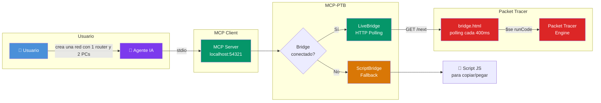

# MCP-PTB

> Servidor MCP zero-config para Cisco Packet Tracer — automatización de redes con agentes IA

[](https://nodejs.org/)
[](https://www.netacad.com/courses/packet-tracer)
[](https://modelcontextprotocol.io/)
[](LICENSE)

## ¿Qué es MCP-PTB?

**MCP-PTB** (Model Context Protocol for Packet Tracer Bridge) es un servidor MCP que conecta agentes IA directamente con Cisco Packet Tracer, permitiéndoles crear y configurar redes usando lenguaje natural.

Olvídate de aprender la interfaz de Packet Tracer o memorizar comandos CLI. Simplemente describe lo que necesitas:

```
"Crea una red con un router 2911, dos switches 2960 y 4 PCs en el segmento 192.168.1.0/24"
```

Y el agente IA lo construye por ti.

## Características

| Característica | Descripción |
|----------------|-------------|
| **Zero-Config** | Auto-build, auto-detección de clientes MCP y verificación de extensiones |
| **12 Clientes Soportados** | OpenCode, Claude, VSCode, Cursor, Gemini, Codex, Windsurf, KiloCode, Kimi, Kiro, Qwen, Antigravity |
| **Auto-Layout** | Posicionamiento automático de dispositivos con algoritmo inteligente |
| **Catálogos Integrados** | +100 dispositivos, módulos, enlaces e interfaces pre-configurados |
| **Ejecución en Tiempo Real** | Bridge WebSocket bidireccional con Packet Tracer (live mode) |
| **Fallback Script** | Funciona incluso sin conexión directa (genera scripts .pkt) |
| **TUI de Instalación** | Instalador interactivo con detección de sistema y configuración automática |

## Requisitos

- **Node.js** ≥ 18.x
- **Cisco Packet Tracer** 7.x o superior
- **Al menos un cliente MCP** compatible (lista de clientes soportados arriba)

## Instalación

### Paso 1 — Clonar el repositorio

```bash
git clone https://github.com/loonbac/mcp-gen-packet.git
cd mcp-gen-packet
```

### Paso 2 — Instalar dependencias y compilar

```bash
npm install && npm run build
```

### Paso 3 — Ejecutar el instalador TUI (opcional pero recomendado)

```bash
npm run install:tui
```

El instalador TUI hace lo siguiente:

```
  ███╗   ███╗ ██████╗██████╗       ██████╗ ████████╗██████╗
  ████╗ ████║██╔════╝██╔══██╗      ██╔══██╗╚══██╔══╝██╔══██╗
  ██╔████╔██║██║     ██████╔╝█████╗██████╔╝   ██║   ██████╔╝
  ██║╚██╔╝██║██║     ██╔═══╝ ╚════╝██╔═══╝    ██║   ██╔══██╗
  ██║ ╚═╝ ██║╚██████╗██║           ██║        ██║   ██████╔╝
  ╚═╝     ╚═╝ ╚═════╝╚═╝           ╚═╝        ╚═╝   ╚═════╝
                  v0.1.0 — por loonbac21

? ¿Qué clientes quieres configurar?
  ✅ OpenCode           — detectado      (pre-seleccionado)
  ❌ Claude             — no detectado
  ❌ VS Code            — no detectado
  ❌ Cursor             — no detectado
  ✅ Gemini CLI         — detectado      (pre-seleccionado)
  ❌ Codex              — no detectado
  ❌ Windsurf           — no detectado
  ❌ Kilocode           — no detectado
  ❌ Kimi               — no detectado
  ❌ Kiro               — no detectado
  ❌ Qwen               — no detectado
  ✅ Antigravity        — detectado      (pre-seleccionado)

  → Los clientes con ✅ están pre-seleccionados. Presiona Enter para configurarlos.

✓ Node.js v25.9.0 detectado
✓ 12 clientes soportados, 3 detectados
✓ Dependencias instaladas
✓ BridgeBuilder.pts encontrado
✓ 3 cliente(s) configurado(s)
```

### Paso 4 — Cargar la extensión en Packet Tracer (una sola vez)

1. **Abre Packet Tracer**

2. Ve al menú: **Extensions → Scripting → Configure PT Script Modules**

3. Haz clic en **Add...**

4. Navega hasta la carpeta donde clonaste el repositorio y selecciona:
   ```
   pt-extension/BridgeBuilder.pts
   ```

5. Haz clic en **OK**

Se abrirá automáticamente una ventana **"MCP-PTB Bridge"** que se conectará al servidor MCP.

## Uso

### El MCP arranca automáticamente

No necesitas ejecutar nada manualmente. Cuando abres tu agente de IA (OpenCode, Gemini, etc.), el servidor MCP se inicia automáticamente y queda listo para recibir comandos.

Simplemente escribe un prompt como:

```"Crea una red con un router 2911, dos switches 2960 y 4 PCs en el segmento 192.168.1.0/24"```

Y el agente lo construye por ti.

### Ejemplos de prompts en español

```
"Conecta un router 2911 con dos switches 2960 usando cables directos"

"Configura 4 PCs con IPs 192.168.1.10-13/24 y gateway 192.168.1.1"

"Crea una topología con router, switch y 3 laptops en la LAN"

"Agrega un módulo WIC-2T al router R1 en la ranura 0"

"Implementa una red pequeña con servidor DHCP en 192.168.0.0/24"
```

## Agentes Soportados

| Agente | ID | Detectado |
|--------|-----|-----------|
| OpenCode | `opencode` | ✅ |
| Claude | `claude` | ✅ |
| VSCode MCP | `vscode` | ✅ |
| Cursor | `cursor` | ✅ |
| Gemini (Google) | `gemini` | ✅ |
| Codex (OpenAI) | `codex` | ✅ |
| Windsurf | `windsurf` | ✅ |
| KiloCode | `kilocode` | ✅ |
| Kimi | `kimi` | ✅ |
| Kiro | `kiro` | ✅ |
| Qwen | `qwen` | ✅ |
| Antigravity | `antigravity` | ✅ |

## Herramientas Disponibles

### Herramientas Primitivas

| Herramienta | Descripción | Parámetros |
|-------------|-------------|------------|
| `packet_tracer_add_device` | Agrega un dispositivo a la topología | `name`, `model`, `x`, `y` |
| `packet_tracer_add_link` | Conecta dos dispositivos con cable | `device1`, `interface1`, `device2`, `interface2` |
| `packet_tracer_add_module` | Agrega un módulo hw a un dispositivo | `device`, `slot`, `module` |
| `packet_tracer_configure_pc_ip` | Configura IP estática en un PC | `device`, `ip`, `mask`, `gateway` |
| `packet_tracer_configure_ios_device` | Envía comandos CLI a dispositivo IOS | `device`, `commands[]` |
| `packet_tracer_get_devices` | Lista todos los dispositivos en la topología | — |
| `packet_tracer_bridge_connect` | Inyecta el bridge WebSocket en PTBuilder | — |

### Herramientas Compuestas

| Herramienta | Descripción | Parámetros |
|-------------|-------------|------------|
| `create_lan_segment` | Crea segmento LAN con PCs configurados | `segmentName`, `network`, `deviceCount` |
| `create_network` | Crea red completa con router, switches y PCs | `networkConfig` |

## Cómo Funciona



### Flujo de ejecución

1. **Usuario** describe la red en lenguaje natural
2. **Agente IA** llama herramientas MCP (`packet_tracer_add_device`, etc.)
3. **MCP Server** recibe y valida el request
4. **Bridge** decide el modo de ejecución:
   - **Live Mode** → HTTP polling → Packet Tracer ejecuta en tiempo real
   - **Script Mode** → genera JS para copiar/pegar (cuando PT no está conectado)
5. **Resultado** vuelve al agente IA

## Catálogos

MCP-PTB incluye catálogos pre-configurados de:

### Dispositivos (+100 modelos)

| Categoría | Modelos |
|-----------|---------|
| Routers | 1841, 1941, 2620XM, 2621XM, 2811, 2901, 2911, 2921, ISR4321, ISR4331, Router-PT |
| Switches | 2950-24, 2960-24TT, 3560-24PS, 3650-24PS, Switch-PT |
| PCs | PC-PT, Server-PT, Laptop-PT, Printer-PT |
| Wireless | AccessPoint-PT, AccessPoint-PT-N, AccessPoint-PT-AC, Linksys-WRT300N |
| IoT | Sensors, Actuators, Smart Devices (39+ tipos thing) |

### Módulos

HWIC-2T, HWIC-4ESW, WIC-1T, WIC-2T, NM-1FE2W, etc.

### Enlaces

Copper Straight-Through, Copper Cross-Over, Fiber, Serial, etc.

## Solución de Problemas

### Error: "dist/index.js no encontrado"

```bash
npm run build
```

### Error: "No se detectaron clientes MCP"

Puedes configurar manualmente. Consulta la documentación de tu cliente específico.

### Error: "pt_bridge_connect retorna PT not connected"

1. Verifica que Packet Tracer esté abierto
2. Verifica que la extensión esté cargada: **Extensions → Scripting** debe mostrar "PTBuilder"
3. Si persiste, reinicia Packet Tracer

### Error: "Unable to setContent"

Asegúrate de usar el `BridgeBuilder.pts` de este repositorio, no un archivo `.pts` modificado.

### Los comandos no se ejecutan

1. Verifica que `pt_bridge_connect` fue llamado exitosamente
2. Verifica que el modelo del dispositivo es correcto (ej: `2911`, no `Cisco 2911`)
3. Revisa la consola de Packet Tracer por errores

### Auto-reconexión

El bridge implementa auto-reconexión:
- Si la conexión WebSocket se pierde, el bridge intenta reconectar automáticamente
- Si el servidor MCP se reinicia, el bridge se reconecta sin llamar `pt_bridge_connect` de nuevo

## Contribuir

**¡Este proyecto necesita tu ayuda para ser mejor!** Cada contribución cuenta, sin importar el tamaño.

### ¿Cómo puedes ayudar?

| Área | Qué necesitamos | Dificultad |
|------|-----------------|------------|
| **Bug fixes** | Encontrar y corregir errores de ejecución en Packet Tracer | Fácil |
| **Catálogos** | Agregar más dispositivos, módulos e interfaces al catálogo | Fácil |
| **Documentación** | Mejorar tutoriales, agregar ejemplos, traducir | Fácil |
| **Tests** | Aumentar cobertura de pruebas | Media |
| **Nuevos clientes MCP** | Soportar más agentes de IA | Media |
| **Herramientas compuestas** | Crear topologías más complejas (VLANs, routing) | Media |
| **Auto-layout** | Mejorar posicionamiento de dispositivos | Media |
| **Zero-config mejorado** | Eliminar pasos manuales restantes | Alta |
| **Cross-platform** | Soporte completo para Linux y macOS | Alta |

### Pasos para contribuir

1. Haz **fork** del repositorio
2. Crea una rama: `git checkout -b feature/mi-mejora`
3. Haz tus cambios y prueba que todo funcione
4. Commit: `git commit -m "feat: descripción del cambio"`
5. Push: `git push origin feature/mi-mejora`
6. Abre un **Pull Request**

### ¿Encontraste un bug?

Abre un [issue](https://github.com/loonbac/mcp-gen-packet/issues) con:
- Descripción del problema
- Pasos para reproducir
- Captura de pantalla (si aplica)
- Versión de Node.js y Packet Tracer

---

## Créditos

- **Autor**: [loonbac21](https://github.com/loonbac) — Joshua Rosales
- **Idea original**: [Yokonad](https://github.com/Yokonad) — [mcp-gemini-packet](https://github.com/Yokonad/mcp-gemini-packet) — la inspiración inicial para conectar MCP con Packet Tracer
- **Proyecto Base**: [PTBuilder](https://github.com/kimmknight/PTBuilder) por kimmknight — referencia para el bridge

## Licencia

PolyForm Noncommercial 1.0.0 — ver archivo [LICENSE](LICENSE). Uso gratuito, modificable y distribuible con créditos. **Prohibido uso comercial.**

---

<div align="center">

**MCP-PTB** — Automatización de redes con agentes IA

¿Preguntas? Abre un [issue](https://github.com/loonbac/mcp-gen-packet/issues)

</div>
